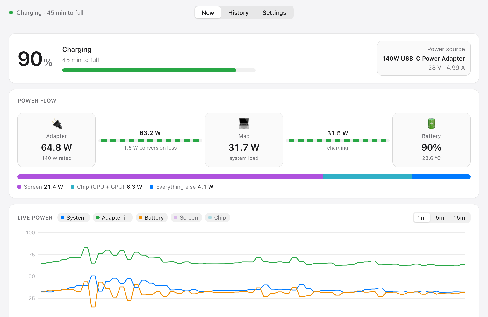

# Pythonflow

A macOS menu bar app that shows where your Mac's power goes: what the charger
delivers, what the Mac uses, and what goes into or comes out of the battery.
It also keeps a history of every charge.



Pythonflow is a Python rewrite of [Powerflow](https://github.com/lzt1008/powerflow)
(originally Rust/Tauri/Vue). The original crashes on launch on macOS 27 and is no
longer maintained. This version fixes those problems and never connects to the
internet.

## Features

- **Live wattage in the menu bar**: system power, screen, or chip. While charging
  it can show the charger's input instead. Click it for a quick summary.
- **Power flow**: charger → Mac → battery, including the charger's conversion loss
  and a breakdown of where the Mac's power goes.
- **Live chart** of the last 1, 5 or 15 minutes.
- **Battery details**: maximum capacity (health), cycle count, charge in mAh,
  temperature, voltage and current.
- **Charger details**: name, rated watts, and negotiated voltage and current.
- **Charging history**: each charge's levels, duration, power curve and averages.
  Export any session to CSV.
- Light and dark mode. It lives in the menu bar, and the Dock icon only appears
  while the dashboard window is open.

## Privacy

- **No network access.** There are no update checks, analytics or crash reports,
  and no local web server. The dashboard runs under a Content-Security-Policy
  that blocks all connections.
- **Reads power sensors only**: the battery registry (`AppleSmartBattery`) and
  the SMC power and temperature sensors. It doesn't read serial numbers or your
  computer's name.
- **Your data stays on your Mac** in `~/Library/Application Support/Pythonflow`.
  You can turn off history recording or delete it all in Settings.

## Install

You need Python 3 from [python.org](https://www.python.org/downloads/).
Pythonflow is tested on macOS 27.0 with Apple silicon.

1. Download the project:

   ```bash
   git clone https://github.com/DigitalN/pythonflow.git
   ```

   (Or use **Code → Download ZIP** on GitHub and unzip it.)
2. In the `pythonflow` folder, double-click **`First Time Setup.command`**. It
   installs the pinned Python packages listed in
   `Application Files/requirements.txt`, then builds `Pythonflow.app` and installs
   it in `/Applications`. If macOS blocks the script, right-click it and choose
   **Open**.
3. Open **Pythonflow** from Applications, Launchpad or Spotlight. It's a normal,
   self-contained app, so Python isn't needed to run it. Its wattage appears in
   the menu bar; click it and choose **Open Dashboard** for the full view.
4. Optional: add it in System Settings → General → Login Items to start it at
   login.

To update later, double-click **`Build Pythonflow.command`**. It pulls the latest
code, runs the tests, and rebuilds and reinstalls the app.

### Coming from the original Powerflow

On first launch, your charging history and preferences from the old app are
copied over. The old database is opened read-only and never changed. After that
you can delete the old `/Applications/powerflow.app`.

## What the numbers mean

| Reading | What it is |
|---|---|
| **System** | Total power the Mac is using right now |
| **Adapter in** | Power going from the charger into the Mac. The Adapter box also adds the charger's conversion loss. |
| **Battery** | Power going into the battery (positive) or coming out of it (negative) |
| **Screen** | Display backlight. On mini-LED screens it rises with bright content. |
| **Chip (CPU + GPU)** | The Apple silicon chip. Apple's sensor for it is named after the heatpipe that cools the chip, but it measures the chip, not the heatpipe or the fans. |
| **Time to full / remaining** | macOS's own estimate. It's rough above ~80% charge, where charging slows down. |

## What was fixed for macOS 27

| Problem in the original | Fix |
|---|---|
| Crashed about half a second after launch | macOS 27 removed several battery readings the app required. Every reading is now optional, and nothing in the sampling code can bring the app down. |
| Battery health and capacity were blank | Reads the values from their new location, with a fallback for older macOS |
| Showed "charging" while sitting at 100% | Trusts the battery's own fully-charged flag over a sensor that gets stuck |
| Showed "1092 hours" remaining | "Still estimating" placeholder values are shown as "calculating…" |
| Menu bar panel wouldn't open | Uses a native macOS menu |
| Menu bar text kept changing width | Fixed-width digits |
| Chart froze after upgrading | Saved settings are validated when loaded |

## Development

```bash
python3 -m pytest
```

```bash
cd "Application Files" && python3 main.py
```

Set `PYTHONFLOW_DATA_DIR=/some/folder` to run against a throwaway data folder.
See [CLAUDE.md](CLAUDE.md) for the architecture and the rules the code follows.

## Credits

Based on [Powerflow](https://github.com/lzt1008/powerflow) by The Powerflow Team
(Samuel Lyon / lzt1008). The macOS 27 fixes build on diagnoses from community pull
requests to the original project:
[#19](https://github.com/lzt1008/powerflow/pull/19),
[#21](https://github.com/lzt1008/powerflow/pull/21) and
[#22](https://github.com/lzt1008/powerflow/pull/22).

## License

MIT. See [LICENSE](LICENSE).
