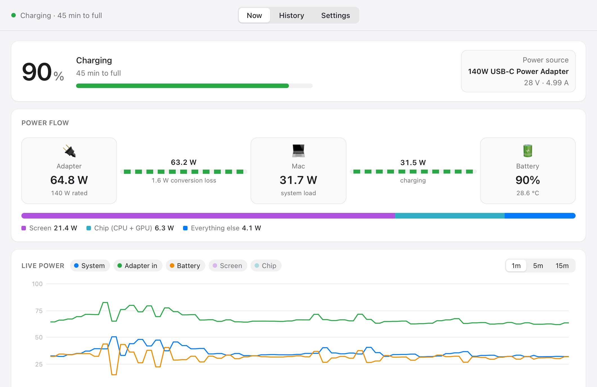

# Pythonflow

A macOS menu bar app that shows where your Mac's power goes: what the charger
delivers, what the Mac uses, and what goes into or comes out of the battery.
It also keeps a history of every charge.

Pythonflow is a Python rewrite of [Powerflow](https://github.com/lzt1008/powerflow)
(originally Rust/Tauri/Vue). The original crashes on launch on macOS 27 and is no
longer maintained. This version fixes those problems, and the only thing it connects
to is GitHub, to update itself.

**[⬇︎ Download the latest version](https://github.com/DigitalN/pythonflow/releases/latest)**
(free, for Macs with Apple silicon)

## Features

- **Live wattage in the menu bar**: system power, screen, or chip. While charging
  it can show the charger's input instead. Click it for a quick summary.
- **Power flow**: charger → Mac → battery, including the charger's conversion loss
  and a breakdown of where the Mac's power goes.
- **Live chart** of the last 1, 5 or 15 minutes.
- **Battery details**: maximum capacity (health), cycle count, charge in mAh,
  temperature, voltage and current.
- **Charger details**: name, rated watts, and negotiated voltage and current.
- **Charging history**: each charge's levels, duration, power curve and averages.
  Export any session to CSV.
- Light and dark mode. It lives in the menu bar, and the Dock icon only appears
  while the dashboard window is open.
- Opens at login and keeps itself up to date. Both can be turned off in Settings.

## Privacy

- **Its only connection is the update check.** Once a day, after your Mac wakes, it
  asks GitHub for the latest release and downloads it if it's new. It installs only
  an app signed by the same developer. There are no analytics or crash reports, and
  no local web server. The dashboard runs under a Content-Security-Policy that blocks
  all connections.
- **Reads power sensors only**: the battery registry (`AppleSmartBattery`) and
  the SMC power and temperature sensors. It doesn't read serial numbers or your
  computer's name.
- **Your data stays on your Mac** in `~/Library/Application Support/Pythonflow`.
  You can turn off history recording or delete it all in Settings.

## Install

1. **Download** `Pythonflow-….dmg` from the
   [latest release](https://github.com/DigitalN/pythonflow/releases/latest) and open it.
2. **Drag Pythonflow into Applications**, as the arrow shows.
3. **Open Pythonflow** from Applications. Its wattage appears in the menu bar; click
   it and choose **Open Dashboard** for the full view.

The first time you open it, macOS may say it can't verify Pythonflow. Click **Done**,
then go to **System Settings → Privacy & Security**, scroll down, and click **Open
Anyway**. You only do this once. It's needed because Pythonflow is free and isn't
distributed through Apple, so Apple hasn't checked it; all of its code is on this page.

Pythonflow is tested on macOS 27.0 with Apple silicon. To build it from source
instead, see [DEVELOPMENT.md](DEVELOPMENT.md).

### Coming from the original Powerflow

On first launch, your charging history and preferences from the old app are
copied over. The old database is opened read-only and never changed. After that
you can delete the old `/Applications/powerflow.app`.

## What the numbers mean

| Reading | What it is |
|---|---|
| **System** | Total power the Mac is using right now |
| **Adapter in** | Power going from the charger into the Mac. The Adapter box also adds the charger's conversion loss. |
| **Battery** | Power going into the battery (positive) or coming out of it (negative) |
| **Screen** | Display backlight. On mini-LED screens it rises with bright content. |
| **Chip (CPU + GPU)** | The Apple silicon chip. Apple's sensor for it is named after the heatpipe that cools the chip, but it measures the chip, not the heatpipe or the fans. |
| **Time to full / remaining** | macOS's own estimate. It's rough above ~80% charge, where charging slows down. |

## What was fixed for macOS 27

| Problem in the original | Fix |
|---|---|
| Crashed about half a second after launch | macOS 27 removed several battery readings the app required. Every reading is now optional, and nothing in the sampling code can bring the app down. |
| Battery health and capacity were blank | Reads the values from their new location, with a fallback for older macOS |
| Showed "charging" while sitting at 100% | Trusts the battery's own fully-charged flag over a sensor that gets stuck |
| Showed "1092 hours" remaining | "Still estimating" placeholder values are shown as "calculating…" |
| Menu bar panel wouldn't open | Uses a native macOS menu |
| Menu bar text kept changing width | Fixed-width digits |
| Chart froze after upgrading | Saved settings are validated when loaded |

## Development

Building from source, the release checklist and how updates work are in
[DEVELOPMENT.md](DEVELOPMENT.md). See [CLAUDE.md](CLAUDE.md) for the architecture and
the rules the code follows.

## Credits

Based on [Powerflow](https://github.com/lzt1008/powerflow) by The Powerflow Team
(Samuel Lyon / lzt1008). The macOS 27 fixes build on diagnoses from community pull
requests to the original project:
[#19](https://github.com/lzt1008/powerflow/pull/19),
[#21](https://github.com/lzt1008/powerflow/pull/21) and
[#22](https://github.com/lzt1008/powerflow/pull/22).

## License

MIT. See [LICENSE](LICENSE).
